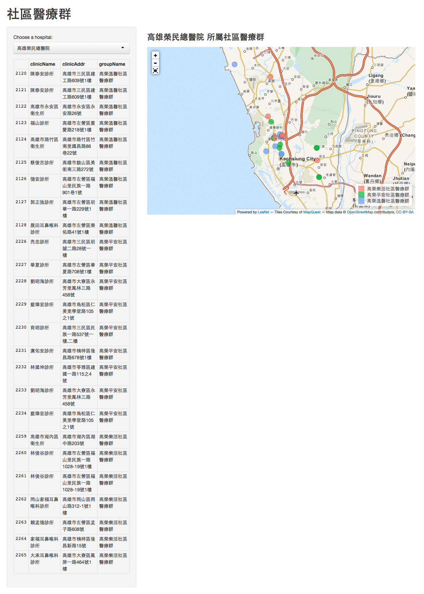

community med care
================

社區醫療群地圖

資料來源：http://www.nhi.gov.tw/OnlineQuery/FamilyDrSearch.aspx

1. `content/clinic_list.csv` 是 2014年5月12日使用 `source/parsing.py` 從健保署的資料抓下來

2. `content/clinicGPS.csv` 是利用 `source/getGPS.R` 透過 Google geocode 得到 GPS 座標，但有些經過手動修改。

地圖呈現，Powered by:

1. [Shiny](http://www.rstudio.com/shiny/)

2. [rCharts](https://github.com/ramnathv/rCharts/)

3. [Leaflet] (http://leafletjs.com/)

4. [OpenStreetMap](http://www.openstreetmap.org)

授權：程式碼以 BSD 授權。授權條款可以分別參見其[網路複本][LICENSE-LINK]以及 `LICENSE_BSD`。

Screenshot
----------------------

